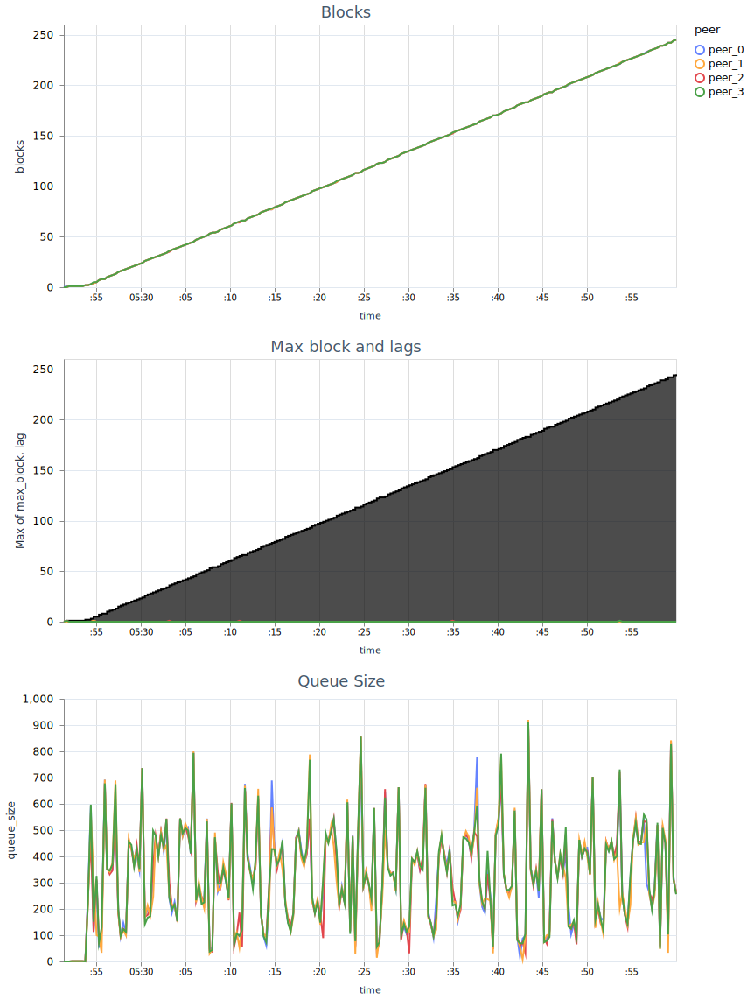

## CASE

| Parameter       | Value |
| --------------- | ----- |
| Peers           | 7     |
| Txs per block   | 50    |
| Queue Capacity  | 1000  |
| Gossip batch    | 5     |
| Gossip interval | 1s    |
| TPS             | 100   |

## CASE

| Parameter       | Value |
| --------------- | ----- |
| Peers           | 4     |
| Txs per block   | 8     |
| Queue Capacity  | 50    |
| Gossip batch    | 1     |
| Gossip interval | 1s    |
| TPS             | 10    |

## CASE

| Parameter       | Value  |
| --------------- | ------ |
| Peers           | 4      |
| Txs per block   | 512    |
| Queue Capacity  | 10,000 |
| Gossip batch    | 500    |
| Gossip interval | 250ms  |
| TPS             | 1900   |

Gossip happens more intensely than TPS

## CASE

| Parameter       | Value  |
| --------------- | ------ |
| Peers           | 4      |
| Txs per block   | 512    |
| Queue Capacity  | 10,000 |
| Gossip batch    | 500    |
| Gossip interval | 1s     |
| TPS             | 1500   |

TPS is higher than gossipping, **but** per-peer it is still less intense than gossiping.

## CASE

| Parameter       | Value |
| --------------- | ----- |
| Peers           | 4     |
| Txs per block   | 512   |
| Queue Capacity  | 1000  |
| Gossip batch    | 10    |
| Gossip interval | 1s    |
| TPS             | 100   |

TPS is higher than gossipping per-peer. (`100 / 4 > 10`). Finally, this leads to the queue overflow on the observing
peer. But the block lag doesn't happen.

## CASE

| Parameter       | Value  |
| --------------- | ------ |
| Peers           | 4      |
| Txs per block   | 512    |
| Queue Capacity  | 10,000 |
| Gossip batch    | 50     |
| Gossip interval | 2s     |
| TPS             | 2000   |

Captured the race condition:

- `Observer` usually receives created block, then committed block - fine
- At some point it receives the committed block A first. Error - no voting block.
- Then it receives "created block" A and saves it as a voting block.
- Then it receives the next "created block" B, and rejects it with a validation error (expected height mismatch). The
  voting block A is still there.
- Then it receives "committed block" B and says there is a hash mismatch with the voting block (A). It discards the
  voting block.
- Then, for all blocks, the cycle repeats:
  - "created block" event - validation failed, height expectation mismatch
  - "committed block" event - peer missing voting block

This is the slice of block events when this happens:

Metrics:

This shows that the blocks `peer_3` commits later than others are in sync with others:

